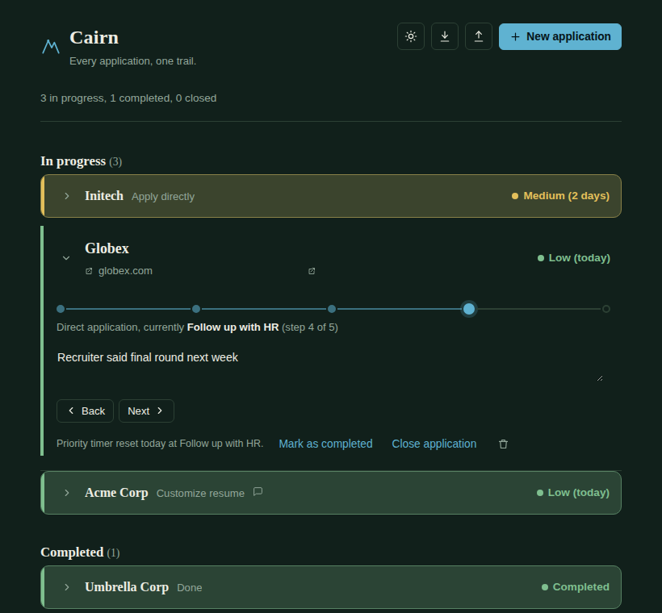

# Cairn

*Every application, one trail.*

A small, offline job-application tracker for personal use. One HTML file, no backend, no account, no build step: open it in a browser and your data stays on your device. Helps keep track of applications when you're applying on 5 different job portals and cold emailing recruiters on a daily basis. Auto-sorts applications on the basis of their urgency. The longer since a listing was added, the more critical it looks, which prompts the user to take action before the listing is taken down.

**Live site:** https://prakhar436.github.io/Cairn/index.html

## Features

- **Two workflow paths** — Direct Application and Referral — each broken into clear stages you move through with Back / Next
- **Automatic priority scoring** (Low → Medium → High → Critical) based on days elapsed since a listing was discovered, with active listings auto-sorted so the most urgent is always on top
- **A confirmation + timer reset** when a listing reaches "Follow up with HR", to account for the waiting period before contacting the HR again
- **Collapsible rows** — color-coded and conspicuous when collapsed for a fast scan, full detail when expanded, with a smooth expand/collapse animation
- **Automatic sectioning** — In progress, then Completed, then Closed
- **Light and dark themes**
- **Export / Import** to back up your data or move it to another browser
- Fully responsive, works on mobile
- Zero dependencies — pure HTML, CSS, and JavaScript, works completely offline

## Getting started

Just open the [live site](https://prakhar436.github.io/Cairn/) — nothing to install.

Or run it locally:
1. Download `index.html` from this repo
2. Double-click it, or open it in any browser

## A note on your data

Cairn saves everything to your browser's local storage. Nothing is ever sent anywhere. That also means:

- Your data lives on this specific browser and device — it won't automatically follow you to a different browser or computer
- Clearing your browser's site data, using a private/incognito window, or switching browsers can wipe or bypass it
- Use the **Export** button occasionally to save a JSON backup, and **Import** to restore it later (in this browser or a new one)

## Tech

Vanilla HTML, CSS, and JavaScript. No frameworks, no build step, no dependencies.

## License

No license has been specified yet. If you want to set usage terms, add a `LICENSE` file — MIT is a common, lightweight choice for a project like this.
